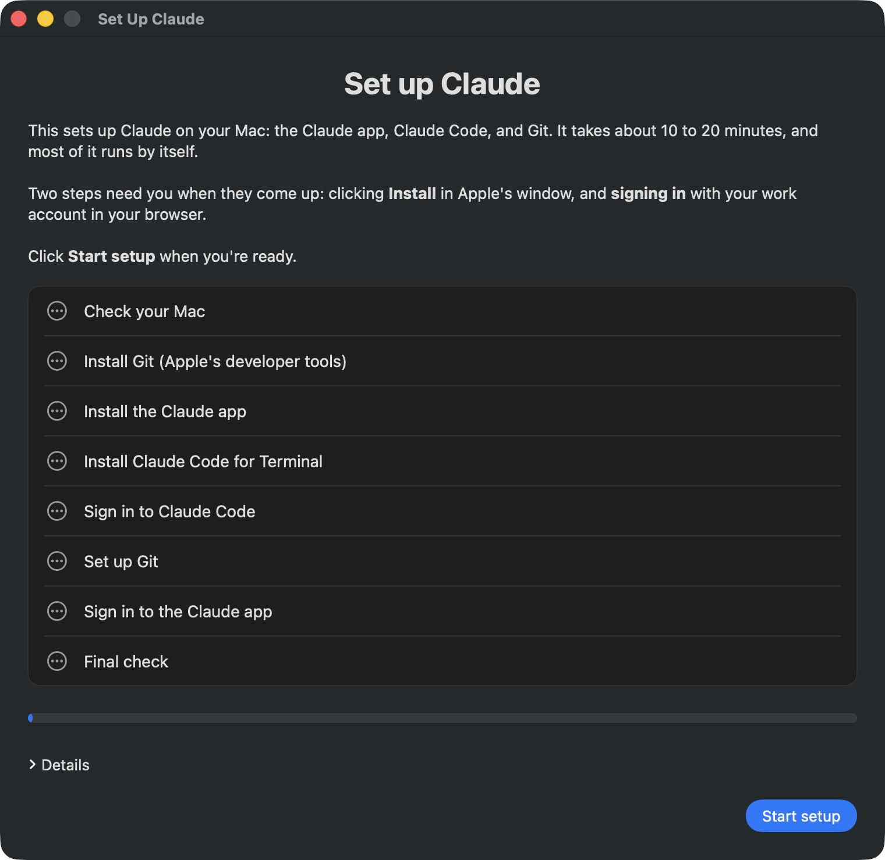
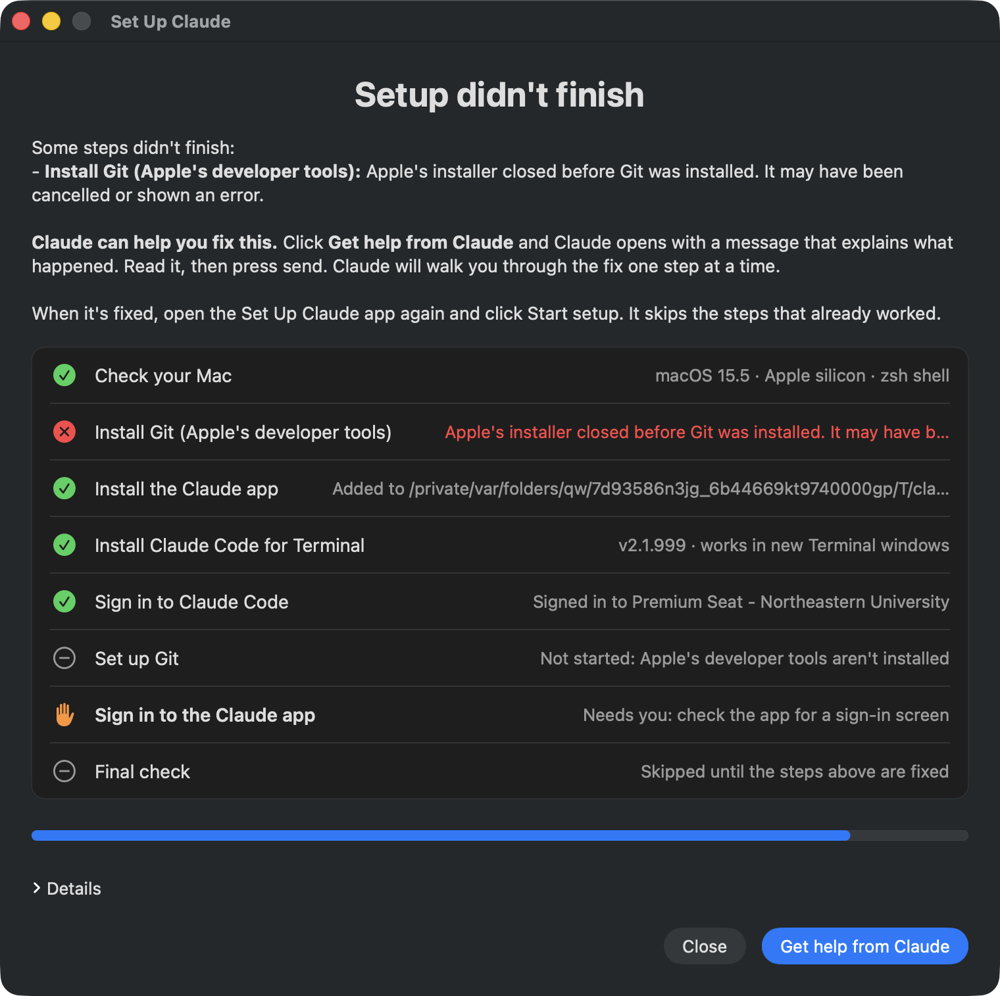
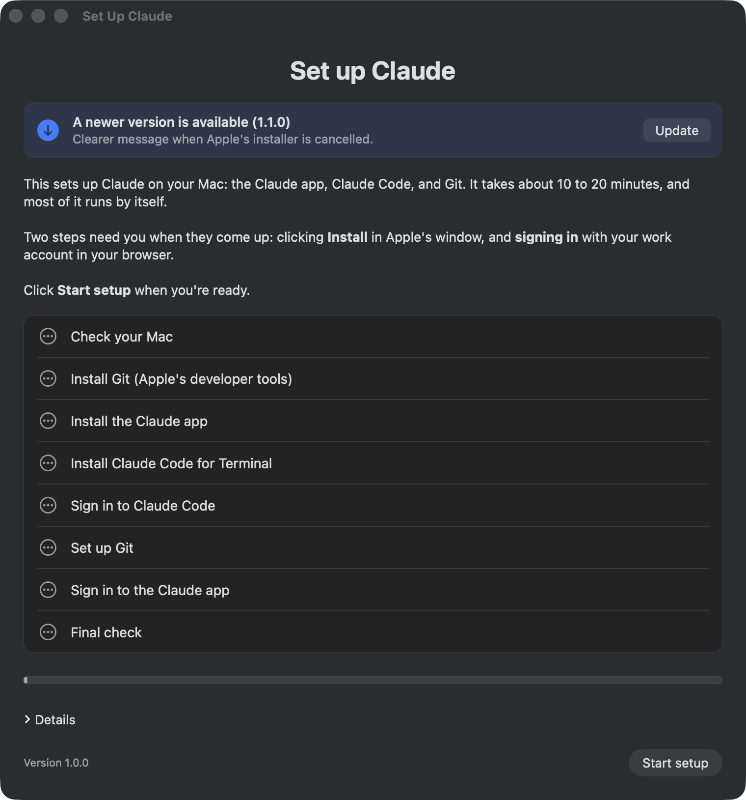
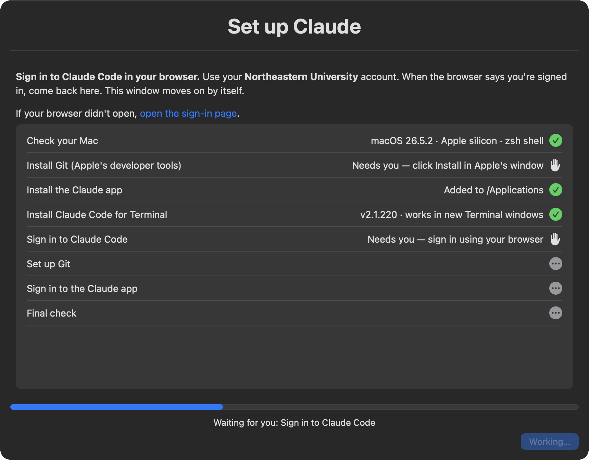

# Set Up Claude

Sets up a Mac for Claude: the Claude app, Claude Code (the `claude` command in Terminal), and Apple's developer tools, which include Git. Every step shows in one window. If something fails, it opens Claude with a message describing what happened, so the person can troubleshoot with Claude's help.

It's built for Northeastern University's Claude Enterprise accounts. The organization and plan it checks for are settings, so other teams can change them.

**[Download Set Up Claude](https://github.com/Excaliburke/set-up-claude/releases/latest/download/Set-Up-Claude.zip)** (macOS 13 Ventura or newer)



It runs as the person themselves. Nothing needs IT, Jamf, or an admin password. It works on Apple silicon Macs. Intel Macs should work too, but haven't been tested.

## Sending it to teammates

The download link above always gives the newest version. A message you can send:

> To set up Claude on your Mac:
> 1. Download Set Up Claude: https://github.com/Excaliburke/set-up-claude/releases/latest/download/Set-Up-Claude.zip
> 2. Double-click the zip to unzip it, then open **Set Up Claude**. macOS asks if you're sure you want to open it; click **Open**.
> 3. Click **Start setup** and follow the window.

The app is signed with the Developer ID "Brian Burke (YX5UZDLY5F)" and notarized by Apple, so macOS only asks its usual one-time question for downloaded apps.

## What happens

The window lists eight steps:

1. Check your Mac
2. Install Git (Apple's developer tools)
3. Install the Claude app
4. Install Claude Code for Terminal
5. Sign in to Claude Code
6. Set up Git
7. Sign in to the Claude app
8. Final check

Each step shows gray dots while it waits its turn, a spinner while it runs, a hand when it needs the person, and a green check or red ✗ when it's done. Two steps need the person, and the window says what to do when they come up:

- **Apple's window:** click Install, then Agree. The download takes 5 to 15 minutes, and the other steps keep going meanwhile.
- **The browser:** sign in with their Northeastern account. If the browser doesn't open, the window shows a link.

**Details** shows the setup's own output, like a Terminal window would. While setup runs, the window can't be closed by accident, and quitting asks first.

At the end the window says **Claude is ready**, with anything left to do, or **Setup didn't finish**, with **Get help from Claude**:



(That screenshot is from a test run on a pretend Mac, which is why the app's folder looks odd.)

Running it again is safe. Each step checks first and skips work that's already done, so someone who fixes a problem with Claude's help can run it again and it picks up from there.

## Updates

When the app opens, it reads `latest.json` from the newest GitHub release. If that release is newer, the app offers it:



Clicking **Update** downloads the new version, checks it, replaces the app where it is, and reopens it. The app only installs a download that:

- matches the checksum in `latest.json`
- is signed by the same Developer ID (team `YX5UZDLY5F`)
- was notarized by Apple

If any check fails, nothing is replaced, and the app says so with a link to download the newest version by hand. Updates are only offered before setup starts, never in the middle of it. If the app was opened straight from Downloads, macOS runs it from a hidden temporary copy, and the update replaces the original instead.

## Get help from Claude

When a step fails, the tool writes a message for Claude that covers:

- which step failed, the exact error, and what the tool tried
- every step's result
- facts about the Mac: macOS version, chip, shell, admin rights, disk space, network, other copies of Claude Code, sign-in state
- the last lines of the log for the failed step
- what the tool changed, such as startup-file edits
- ground rules: no API keys or personal accounts, no `sudo npm`, say plainly when something needs admin rights or an account change, and how to run setup again once it's fixed

Before it goes anywhere, the message is cleaned: the person's username and home folder, email addresses, API keys, sign-in secrets, and IDs are replaced with placeholders. It's capped at 12,000 characters (Claude's link limit is about 14,000).

Clicking **Get help from Claude** opens a new chat in the Claude app with the message filled in but not sent, so the person reads it first. The message also goes on the clipboard and is saved to `~/Library/Application Support/ClaudeSetup/logs/<run>/help-message.txt`. If the Claude app didn't install, claude.ai opens in the browser instead and the person pastes with Command-V.

Claude in chat can't see the Mac, so the message asks Claude for one step or one command at a time, and to ask the person to paste back what they see.

To see exactly what the hand-off looks like:

```bash
bash claude-setup.sh --preview-help
```

It uses a pretend failure (Apple's installer cancelled) with the Mac's real details, opens Claude with the message, and installs or changes nothing.

## The Terminal version

The same steps run from Terminal, with the window drawn by [swiftDialog](https://github.com/swiftDialog/swiftDialog). Paste this into Terminal; it always runs the newest release:

```bash
/bin/bash -c "$(curl -fsSL https://github.com/Excaliburke/set-up-claude/releases/latest/download/claude-setup.sh)"
```

Or download `claude-setup.sh` from the [newest release](https://github.com/Excaliburke/set-up-claude/releases/latest) and run it:

```bash
bash ~/Downloads/claude-setup.sh
```

A downloaded copy checks GitHub when it starts. If a newer release exists, it says so in Terminal and in the window, then carries on. The failure screen and the help message include the exact command to run setup again.



## Settings

The settings are at the top of `claude-setup.sh`. Each can also be set as an environment variable with the same name prefixed by `CLAUDE_SETUP_`. The app carries its own copy of the script, so settings changes reach people through a new release.

| Setting | Default | What it does |
| --- | --- | --- |
| `ORG_LABEL` | `Northeastern University` | Shown to people: "Sign in with your … account" |
| `ORG_NAME_MATCH` | `Northeastern University` | After sign-in, the organization name must contain this |
| `ORG_ID` | empty (off) | Exact organization ID to require. Leave it empty if people are on different seat types, which can be separate organizations ("Premium Seat - Northeastern University", for example) |
| `REQUIRED_PLAN` | `enterprise` | The plan the account must be on |
| `RERUN_COMMAND` | empty (worked out automatically) | The command to run the script again: `bash <the file>` when it runs from a file, otherwise the one-line GitHub command. The app uses its own wording |
| `USE_SSO` | `0` | `1` forces single sign-on at the Claude Code sign-in |
| `USE_WINDOW` | `1` | Terminal version only: `0` shows progress in Terminal instead of a window |
| `TURN_OFF_API_KEYS` | `1` | Comments out `ANTHROPIC_API_KEY` lines in shell startup files |

## macOS versions

| macOS | What happens |
| --- | --- |
| 11 or 12 | The app needs macOS 13 and won't open. The Terminal version stops at the first step with "macOS 12.x is too old. Claude needs macOS 13 or newer.", and **Get help from Claude** walks the person through updating. |
| 13 (Ventura) or 14 (Sonoma) | Works. The Terminal version's window uses swiftDialog 2.5.6, the last version for these releases, and shows a yellow "!" instead of a hand for steps that need the person. |
| 15 (Sequoia) or newer | Works. The Terminal version's window uses swiftDialog 3.1.0. |

If the Terminal version's window can't be set up for any reason, it shows the same progress in Terminal and still offers help from Claude at the end.

## What it changes on a Mac

- **Installs** Claude Code with Anthropic's official installer into `~/.local/bin`, the Claude app into `/Applications` (or `~/Applications` without admin rights), and Apple's Command Line Tools through Apple's own installer.
- **Adds** a marked block to the shell startup file so new Terminal windows find `claude`. That's `~/.zshrc` for zsh. For bash it's the first of `~/.bash_profile`, `~/.bash_login` or `~/.profile` that exists. Fish gets a file in `conf.d`.
- **Turns off** (comments out, never deletes) `ANTHROPIC_API_KEY` lines and old `alias claude=…/.claude/local` lines in shell startup files. Before any edit, it saves a backup next to the file, named `.before-claude-setup-<date>`.
- **Sets** Git's name and email if they're empty, using the Mac account name and the Claude sign-in email.
- **Signs out of Claude Code** if it's signed in to a different account, then asks the person to sign in again, up to two tries.
- **Downloads swiftDialog** (Terminal version only) into `~/Library/Application Support/ClaudeSetup` to draw the window. The tool checks that it's signed by its developer (team `PWA5E9TQ59`) and approved by Apple before using it. Nothing is installed system-wide.
- **Keeps logs** in `~/Library/Application Support/ClaudeSetup/logs`.

Every download is checked before it's used: the Claude app must be signed by Anthropic (team `Q6L2SF6YDW`), and the installer must be a script, not a web page.

## What it doesn't do

- **Remove other copies of Claude Code** (npm, Homebrew, old installs). It reports them, and its PATH line makes sure the new copy is the one that runs.
- **Check the Claude app's sign-in.** The app doesn't make that visible to scripts, so the tool opens the app and lists signing in under "Still to do."
- **Lock sign-in to an organization.** Claude Code supports that through managed settings, but only an IT-deployed file can enforce it. The tool checks the account after sign-in instead.
- **Ask for an admin password.**

## Releasing a new version

```bash
bash release.sh 1.1.0 "What changed, in a sentence or two."
```

The notes show in the app's update offer, so write them for the people using it. The script:

1. checks that the code is committed, on `main`, and in step with GitHub, and that the version is higher than the newest release
2. sets the version in `VERSION` and `claude-setup.sh`, and commits that
3. builds the app, signs it, has Apple notarize it, and checks that Gatekeeper accepts it
4. writes `latest.json` with the version, download address, checksum and notes
5. tags the version, pushes, and creates the GitHub release with `Set-Up-Claude.zip`, `claude-setup.sh` and `latest.json`

Nothing is published until signing and notarization have worked. Copies of the app already out there see the new version the next time they open.

It needs, on the Mac doing the release:

- the GitHub CLI, signed in (`gh auth login`)
- Apple's Command Line Tools
- the Developer ID certificate in the keychain
- the `set-up-claude` notarization login, saved once with `xcrun notarytool store-credentials set-up-claude --team-id YX5UZDLY5F` (it asks for the Apple ID and an app-specific password from account.apple.com)

## Building and testing

To build the app without publishing anything (an unsigned test build unless signing is set up):

```bash
bash app/build-app.sh
DEVELOPER_ID="Developer ID Application: Brian Burke (YX5UZDLY5F)" NOTARY_PROFILE=set-up-claude bash app/build-app.sh
```

The second line signs and notarizes too. Either way the app lands in `dist/`, which isn't part of the repository.

The tests:

```bash
bash tests/run-tests.sh
bash tests/test-app.sh
```

`run-tests.sh` runs the whole script against a pretend Mac: a throwaway home folder plus stand-ins for `curl`, `xcode-select`, `claude`, `git`, `hdiutil`, `codesign`, `open`, and the window. Nothing on the computer running it is installed or changed. It takes about three minutes and covers:

- a fresh Mac, and running it again
- bash users
- old API keys and aliases
- wrong-account sign-ins
- Apple's installer cancelled or broken
- no network
- an old macOS
- an unsigned app
- the Terminal version's window: success and failure screens
- Homebrew- or Anaconda-style tools earlier in PATH (the script uses macOS's own tools)
- macOS 13, 14 and 15, each getting the right version of swiftDialog
- the rerun command: from a file, from the web, and set by hand
- an older downloaded copy noticing a newer release
- the help preview
- running inside the app: progress reports, and the Get help from Claude and Close choices

`test-app.sh` needs a signed, notarized build in `dist/`. It opens the real app for about a minute:

- on the pretend Mac with Apple's installer "cancelled", checking that **Get help from Claude** reaches Claude
- with a pretend newer release, checking that the app installs it, stays signed by the same developer, and reopens
- with a release whose checksum doesn't match, checking that the app refuses it and leaves itself alone

## Files

| File | What it is |
| --- | --- |
| `claude-setup.sh` | The setup tool. The app runs this same file |
| `app/SetUpClaude.swift` | The app: its window and its updater |
| `app/Info.plist`, `app/make-icon.swift` | The app's details and icon |
| `app/build-app.sh` | Builds `dist/Set Up Claude.app` and `dist/Set-Up-Claude.zip` |
| `release.sh` | Publishes a new version on GitHub |
| `VERSION` | The current version |
| `tests/run-tests.sh`, `tests/test-app.sh` | The tests |
| `screenshots/` | Pictures used in this README |
